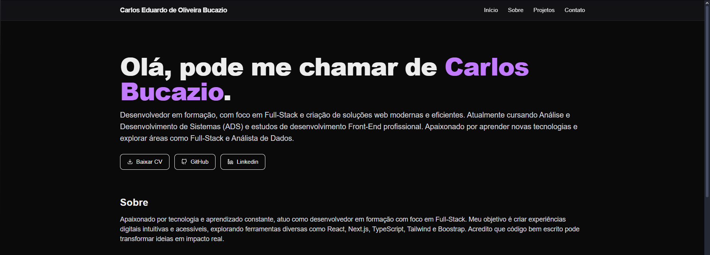

# 🌐 Meu Portfólio

Este é o repositório do meu portfólio pessoal, desenvolvido com **Next.js**, **TypeScript**, **TailwindCSS**, **Framer Motion** e **React Icons**.
O objetivo é apresentar meus projetos, minhas habilidades e facilitar o contato com recrutadores e colaboradores.

## 🚀 Tecnologias utilizadas
- [Next.js](https://nextjs.org/) - Framework React
- [TypeScript](https://www.typescriptlang.org/) - Tipagem estática
- [TailwindCSS](https://tailwindcss.com/) - Estilização
- [Framer Motion](https://www.framer.com/motion/) - Animações
- [React Icons](https://react-icons.github.io/react-icons/) - Ícones

## 📸 Preview


🔗 **Deploy online**: [Acesse aqui](https://meu-portfolio.vercel.app)

## 📂 Estrutura do projeto
- `src/app` → Estrutura principal das páginas;
- `src/components` → Componentes reutilizáveis (Hero, ProjectCard, etc);
- `public/` → Imagens, vídeos e arquivos estáticos.

## 🛠 Como rodar localmente
Clone este repositório e instale as dependências:

```bash
git clone https://github.com/Krl0sEd/meuportfolio.git
cd meuportfolio
npm install
npm run dev


## 📬 Contato

- 💻 Estudante de **Análise e Desenvolvimento de Sistemas** | Foco em **Desenvolvimento Web & Redes**
- 📧 **Email**: [cbucazio@gmail.com](mailto:cbucazio@gmail.com)
- 🌐 **GitHub**: [Krl0sEd](https://github.com/Krl0sEd)
- 🧑‍💼 **Linkedin**: [linkedin.com/in/carlos-eduardo-de-oliveira-bucazio-516a7937a](https://www.linkedin.com/in/carlos-eduardo-de-oliveira-bucazio-516a7937a)

**✨ Feito com dedicação por Carlos Eduardo de Oliveira Bucazio 🚀**

---


